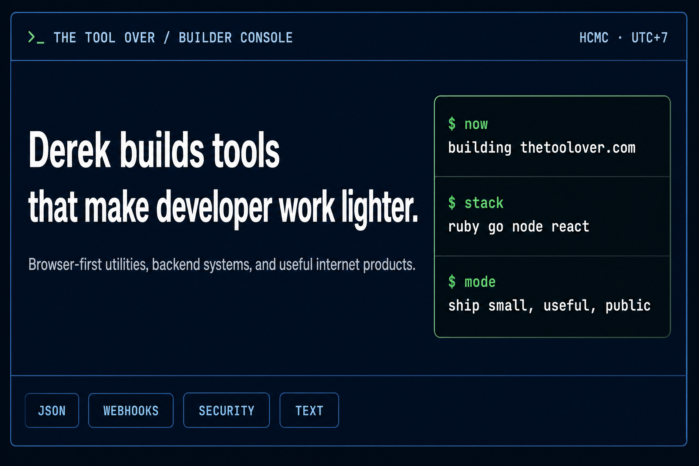

  

  <a href="https://thetoolover.com">TOOlover</a>
  &nbsp;&nbsp;·&nbsp;&nbsp;
  <a href="https://github.com/dereknguyen269?tab=repositories">Repositories</a>
  &nbsp;&nbsp;·&nbsp;&nbsp;
  <a href="https://helloderek.substack.com">Writing</a>
  &nbsp;&nbsp;·&nbsp;&nbsp;
  <a href="https://x.com/derek_in_tech">X</a>

# Hey, I’m Derek Nguyen

I’m a software engineer and indie builder based in **Ho Chi Minh City, Vietnam**. I build developer utilities, backend systems, and small internet products with a bias toward software that is fast to open, useful without ceremony, and easy to share.

## What I’m building

### [TOOlover — free browser developer tools](https://thetoolover.com)

Stop losing momentum to one-off scripts, tab-hunting, and repetitive cleanup. **TOOlover puts the small developer utilities you need in one fast, free browser toolbox—no signup required.**

Use it to format and validate JSON, compare or convert data, test webhooks, inspect JWTs, generate secure secrets, preview Markdown and HTML, clean up text, and explore lightweight system simulations.[^1]

  
  
  
  

**Try a tool, solve the interruption, and get back to building.** [Open TOOlover →](https://thetoolover.com/apps)

## Selected work

| Project | Focus | Why it is useful |
| --- | --- | --- |
| [programing-best-practices](https://github.com/dereknguyen269/programing-best-practices) | Programming fundamentals | Practical best practices for beginners and working developers. |
| [AI-Powered-Coding-Tools](https://github.com/dereknguyen269/AI-Powered-Coding-Tools) | AI-assisted development | A guide to working effectively with AI-powered coding tools. |
| [derek-power](https://github.com/dereknguyen269/derek-power) | Developer workflow | A structured development workflow for Kiro that avoids “vibe coding.” |
| [email_detected](https://github.com/dereknguyen269/email_detected) | Ruby tooling | A Ruby gem for checking whether an email address exists. |
| [threads_client_ruby](https://github.com/dereknguyen269/threads_client_ruby) | API client | An unofficial Ruby client for Meta Threads. |

## Builder stack

| Layer | Tools I reach for |
| --- | --- |
| **Backend** | Ruby · Go · Node.js |
| **Frontend** | React · JavaScript · HTML · CSS |
| **Data** | PostgreSQL · MySQL · Redis |
| **Cloud** | AWS · Google Cloud · DigitalOcean |
| **Product mode** | Ship small · keep it useful · make it public |

## Public profile snapshot

| Signal | Current public value |
| --- | ---: |
| Public repositories | 93 |
| GitHub followers | 149 |
| GitHub location | Ho Chi Minh City, Vietnam |
| Writing | System design and software engineering insights |

These profile signals are read from my public GitHub profile and may change over time.[^2] For always-current activity, visit my [repositories](https://github.com/dereknguyen269?tab=repositories) and [profile overview](https://github.com/dereknguyen269?tab=overview).

## GitHub activity

  
  

  

  

## Find me elsewhere

- **Product:** [thetoolover.com](https://thetoolover.com)
- **Writing:** [System Design Insights with Derek](https://helloderek.substack.com)
- **Social:** [@derek_in_tech on X](https://x.com/derek_in_tech)
- **Code:** [@dereknguyen269 on GitHub](https://github.com/dereknguyen269)

> I like coffee, developer tools, and engineering work that quietly saves people time.

[^1]: [TOOlover](https://thetoolover.com), current public product page and feature descriptions.
[^2]: [Derek Nguyen’s public GitHub profile](https://github.com/dereknguyen269), accessed August 25, 2026.
